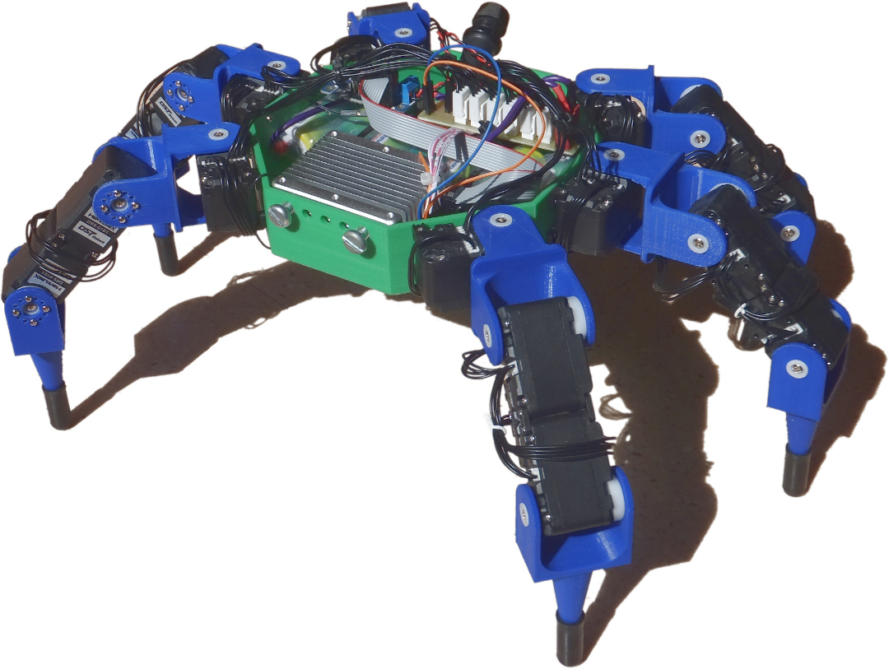

[](https://kraby.readthedocs.io/en/latest/)
[](LICENSE)

# Kraby



Kraby is an hexapod robot.
It is an open source development platform for educational purpose.
It was designed for a Master 1
project at [ENS Paris-Saclay](https://ens-paris-saclay.fr/).

You may read documentation at <https://kraby.readthedocs.io/>

## Build the documentation

Install `mkdocs` then run `mkdocs serve`.

## Install OpenAI environment

```
cd kraby
pip install -e . --user
python -m gym_kraby.demo
```

## License

This project is under GNU General Public License v3.0 because we believe in
open development. Please see LICENSE file for more details.
