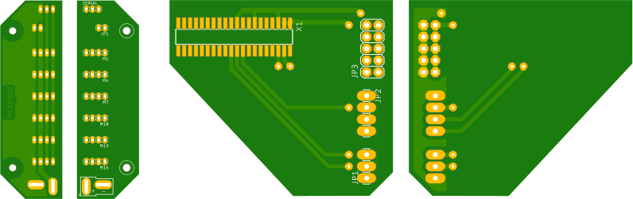

# Kraby the Hexapod -- CAD files

CAD files for Kraby the Hexapod such as PCB designs.

## What's inside?

  * `printed_circuit_boards/nanopi_shield` is a shield that connects on NanoPi
    Neo4 expansion header and provides headers for UART, I2C and 5v power.
  * `printed_circuit_boards/power_board` is a power distribution board
    and connects all servomotors to one UART bus.

## How to connect all the electronics

For the battery, you should use a fuse and a switch in serie and then connect
onto the large battery connector of the power board.

## Software used

PCB files were designed with Eagle 9.5.1.

## License

This project is under GNU General Public License v3.0 because we believe in
open development. Please see LICENSE file for more details.
