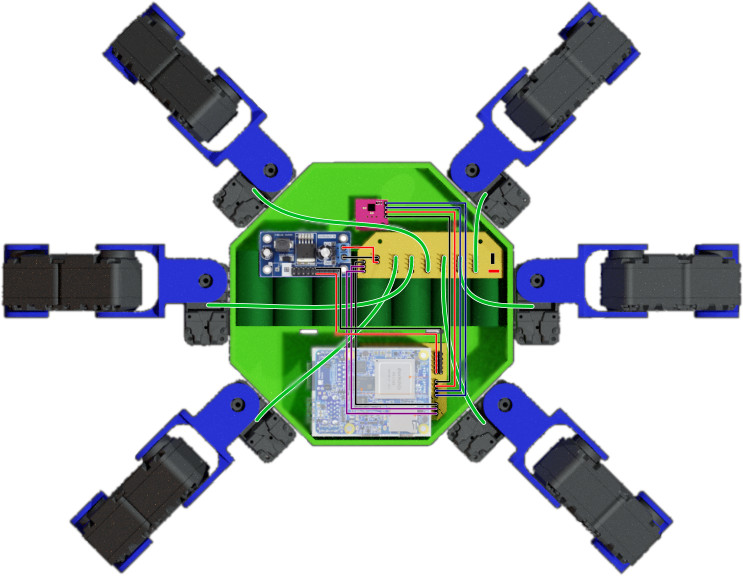

# Print PCB

PCB were designed using Eagle 9, which demo version is sufficient.
PCB design files are available here :
<https://github.com/erdnaxe/kraby/tree/master/printed_circuit_boards>.

  * `printed_circuit_boards/nanopi_shield` is a shield that connects on NanoPi
    Neo4 expansion header and provides headers for UART, I2C and 5v power.
  * `printed_circuit_boards/power_board` is a power distribution board
    and connects all servomotors to one UART bus.

# How to wire it up

For the battery, **you should use a fuse** and a switch in series
and then connect onto the large battery connector of the power board.

