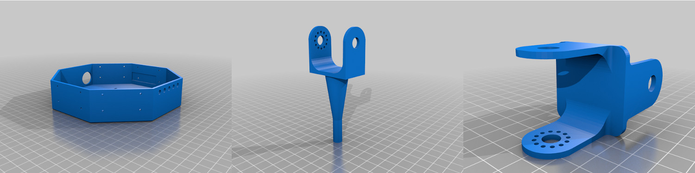

# 3D-printed parts

Blender source files and STL are available
at <https://github.com/erdnaxe/kraby>
or on [Thingiverse](https://www.thingiverse.com/thing:4135774).

To build the robot, you will need to print:

 * 6x `joint.stl`
 * 6x `foot.stl`
 * 1x `box.stl`

## Non-printed parts

 * 18x [HerkuleX DRS-0101 servomotors](https://www.dfrobot.com/product-963.html)
 * 7x SubC NiMH 3000mAh, mine are from [Conrad](https://www.conrad.fr/)
 * 6x Rubber endcap 0.313" x 1.25", like [Lynxmotion REC-02](https://www.robotshop.com/eu/fr/capuchons-caoutchouc-lynxmotion-rec-02.html)
 * or 6x [Rubber endcap with foot switch](https://www.robotshop.com/eu/fr/pair-capteurs-contact-pied-lynxmotion.html)
 * optional 1x [NanoPi Neo4](http://wiki.friendlyarm.com/wiki/index.php/NanoPi_NEO4) or a serial interface
 * optional 1x [LM2596 - 5V 3A regulator board](https://www.robotshop.com/eu/fr/module-convertisseur-abaisseur-dc-dc-5v.html) (to power NanoPi for example)

