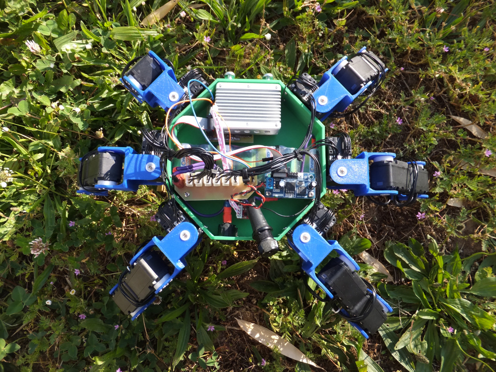
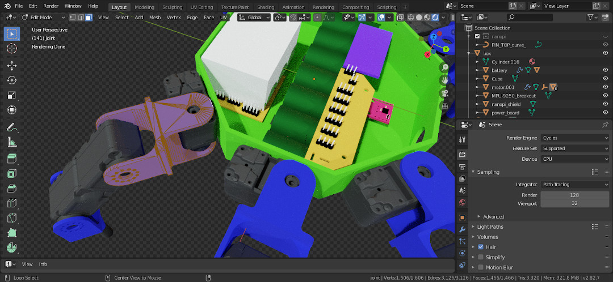

# Kraby

Open-source hexapod robot.

* * *

## Overview

Kraby is an **open-source**, **3d-printable** hexapod robot that is geared towards
building a solid development platform for research and educational purpose.

The robot was designed during a Master 1
project at [ENS Paris-Saclay](https://ens-paris-saclay.fr/), France.

### Easy to remix

The robot was designed using [Blender](https://www.blender.org/),
a free and open-source 3D computer graphics editing software.
Download and remix [Kraby Blender sources](https://github.com/erdnaxe/kraby/tree/master/3d_parts/Blender).

### Smart servo-motors

Kraby uses 18 **Herkulex DRS-0101** servomotors from Dongbu to stay cost
effective while offering reasonable performances.
These includes a DC motor, a gear reducer, a control circuitry and
serial communications capability.
These servomotors are able to measure motor torque and speed, and are easy to
use with a serial port.

Even though the embedded computer has two free serial ports, getting all sensors values of 18 servomotors take an average of 40 ms, see [more details there](use_motors.md#how-slow-is-it).
This means Kraby may be too slow to do proper torque control, that is why we try to use them in position control.

These servomotors are similar to the more popular **Dynamixel AX-12**.

### Simulation environment included

[OpenAI Gym](https://gym.openai.com/) environments are available and packaged as [gym-kraby](https://pypi.org/project/gym-kraby/) on PyPi.
It uses [BulletPhysics](https://github.com/bulletphysics/bullet3) simulator
with [an URDF description](https://github.com/erdnaxe/kraby/blob/master/gym_kraby/data/hexapod.urdf) of the robot,
see [more details there](gym_environments.md).

* * *

## Build instructions

To build a fully featured robot you will need to
[build the structure](build_the_structure)
then [build the electronics](build_the_electronics).

* * *

## Getting help

To get help with Kraby,
please join [#kraby:auro.re](https://matrix.to/#/#kraby:auro.re) Matrix room or
use [GitHub issues](https://github.com/erdnaxe/kraby/issues).
