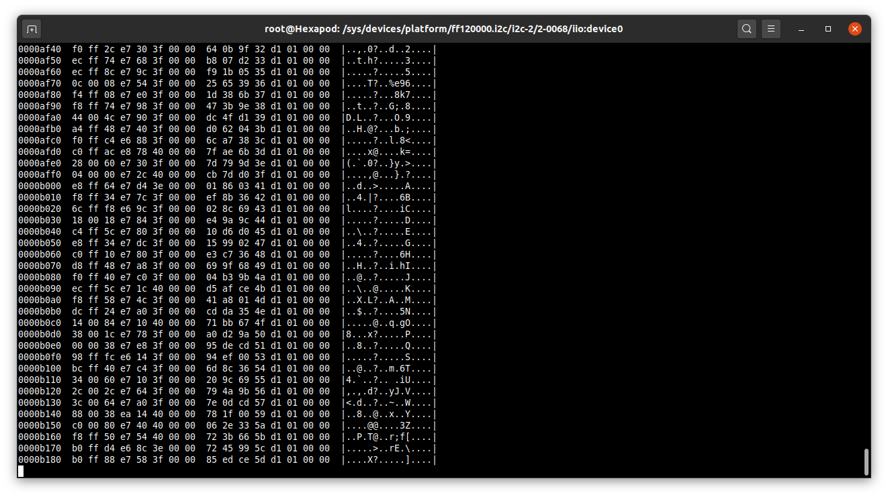

# Compile NanoPi linux kernel with MPU9250 module

As of may 2020, only the official NanoPi kernel supports NanoPi Neo4 GPU and VPU.
The downside is this kernel does not include `inv-mpu-iio` that supports the MPU9250,
so we are going to compile the kernel with this module.

`inv-mpu-iio` is a Linux Industrial I/O (IIO) subsystem driver
that provides an unified framework for sensors.

Install an ARM64 toolchain and download NanoPi kernel source code,
```bash
sudo apt install build-essential gcc-aarch64-linux-gnu gcc-arm-none-eabi
git clone https://github.com/friendlyarm/kernel-rockchip --depth 1 -b nanopi4-linux-v4.4.y
cd kernel-rockchip
```

Load NanoPi Linux configuration, `make ARCH=arm64 nanopi4_linux_defconfig`.

Add MPU9250 module, `make ARCH=arm64 menuconfig` then
`Device drivers > Staging drivers > IIO staging drivers > [*] Invensense MPU devices`.

Add the MPU9250 to the board device-tree, edit `arch/arm64/boot/dts/rockchip/rk3399-nanopi4-common.dtsi`
and change:
```C
&i2c2 {
    status = "okay";

    mpu9250: mpu@68 {
        compatible = "invensense,mpu9250";
        reg = <0x68>;
        mpu-int_config = <0x00>;
        mpu-level_shifter = <0>;
        mpu-orientation = <1 0 0 0 1 0 0 0 1>;
        orientation-x = <1>;
        orientation-y = <1>;
        orientation-z = <1>;
        irq-gpio = <&gpio1 0 1>;
        mpu-debug = <1>;
    };
};
```

Compile with `make ARCH=arm64 nanopi4-images`.
This will generate `kernel.img` and `resource.img` files.

*Note:* you can directly update the running kernel without reflashing rootfs with
`sudo dd if=kernel.img of=/dev/mmcblk1p5` and `sudo dd if=resource.img of=/dev/mmcblk1p4`.
Please use with caution, you may brick your device!

# Install modified FriendlyCore

FriendlyCore uses an overlay filesystem, so removing software such as xorg after the flashing is useless.

Download FriendlyCore from <http://download.friendlyarm.com/NanoPiNEO4>.
At the time of wrtting this tutorial, it was `rk3399-eflasher-friendlycore-bionic-4.4-arm64-20200409.img`.

Dump image on a SD Card (at least 8GB), `dd if=rk3399-eflasher...img of=/dev/mmcblk0 status=progress`.

Remplace `friendlycore-arm64/kernel.img` and `friendlycore-arm64/resource.img` files on the SD card
with those generated in the previous section.


Boot and install FriendlyCore with screen and keyboard attached, then reboot without SD card.
Run `npi-config` and change user password and enable SSH access.

Disable PWM Fan service, udisk, polkit, Bluetooth and ModemManager,
`sudo systemctl disable pwm-fan udisks2 polkit bluetooth ModemManager`.
Also block Bluetooth `sudo rfkill block 0`.

Edit `/etc/rc.local` to:
```bash
#!/bin/sh -e
exit 0
```

Add Hotspot WiFi network,
```bash
sudo nmcli dev wifi hotspot ifname wlan0 ssid Hexapod password "tfpopcorns"
sudo nmcli connection modify Hotspot autoconnect yes
sudo nmcli connection up Hotspot
```

Reboot and connect to WiFi "Hexapod" with password "tfpopcorns",
then `ssh pi@10.42.0.1`.

*Note:* you can plug wired Internet access
and NetworkManager will automatically use and share this connection.

# Test the MPU9250

The `inv_mpu_iio` kernel driver makes the MPU9250 available in
`/sys/bus/iio/devices/iio:device0` and `/dev/iio:device0`.

```bash
cat "/sys/bus/iio/devices/iio:device0/self_test"
```

If `3` appears, i.e. `11` in binary,
then accelerometer and gyrometer work as expected.

Then you can try to stream a gyrometer axis,

```bash
echo 1 > /sys/bus/iio/devices/iio:device0/scan_elements/in_accel_x_en
echo 1 > /sys/bus/iio/devices/iio:device0/buffer/enable
hexdump -C /dev/iio\:device0
```



