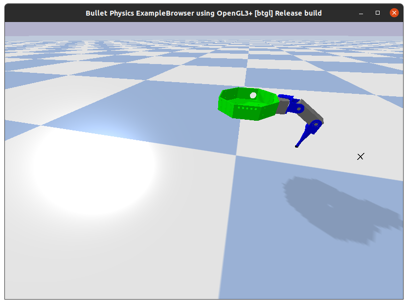
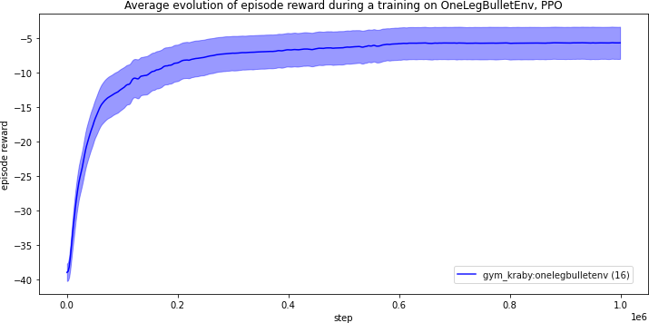

# Training one hexapod leg

This section gives some example of training and draws some conclusions about
the training of a single robot leg.

The environment resets the leg to a random position.
The agent has to command each servomotors
to move the endcap to the objective (visualized by the cross).
```Python
# Reset all joint using normal distribution
for j in self.joint_list:
    p.resetJointState(self.robot_id, j,
                      np.random.uniform(low=-np.pi/4, high=np.pi/4))
```



**Note**: Some early tests were done on StableBaselines3
but as the library is currently being developed,
the training was failing and the average episode reward was constant.

## First tests with pytorch-a2c-ppo-acktr-gail

The defaults hyperparameters given in the
[README](https://github.com/ikostrikov/pytorch-a2c-ppo-acktr-gail/blob/master/README.md)
are recommanded and are able to give good results for a first training.

**Important**: The reward function is only using the distance to a **fixed** objective,
and the observation contains the position, velocity and torque of each servomotors
and also **the absolute position of the endcap** of the leg.
_This agent is trained on an unrealistic environment._



**The training is successful and converges after 300k steps.**
The `enjoy.py` script shows the leg moving to the fixed target,
but it vibrates after reaching the objective.

## Testing StableBaselines

Start StableBaselines Docker as explained in [previous page](implementations_ppo.md).
Then in Jupyter web interface,

-   `check_env.ipynb` will check that OpenAI Gym environments are working as expected,
-   `one_leg_training.ipynb` is an example of PPO training on one leg,
-   `render.ipynb` will render the agent to a MP4 video or a GIF.

As planned, it works as well as `pytorch-a2c-ppo-acktr-gail` on PyTorch,
but this time we get much more tools such as
[TensorBoard](https://www.tensorflow.org/tensorboard) data and graph.

As StableBaselines stands out as being an easy PPO implementation
with a clear documentation and hyperparameters,
all the following training were done with it.

## Fixing the unrealistic observation and reward

There are two problems with the previous trainings:

1.  The reward function is the opposite of the distance to a fixed objective.
    Or we want the leg to be able to move to any objective that the user inputs.

2.  The observation contains the absolute position of the endcap.

The second point could be fixed by computing
it through a mecanical computing using servomotors positions.
But before doing it, it is also interesting to study the learning when
the absolute position is remplaced by:

-   the objective position (constant during one episode),
-   the objective position vector substracted by the current position.

The second idea comes from
[OpenAI Gym Reacher-v2 environment](https://github.com/openai/gym/wiki/Reacher-v2).
This environment also input cosinus and sinus
of the joint position in the observation,
rather than directly the angle.
