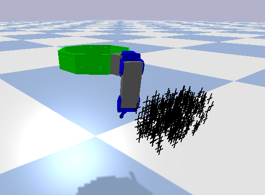
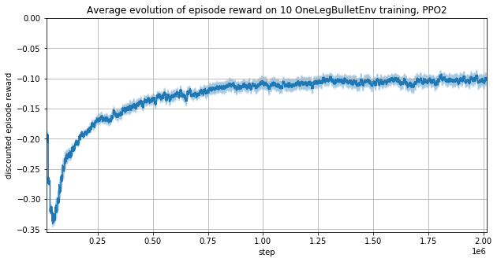
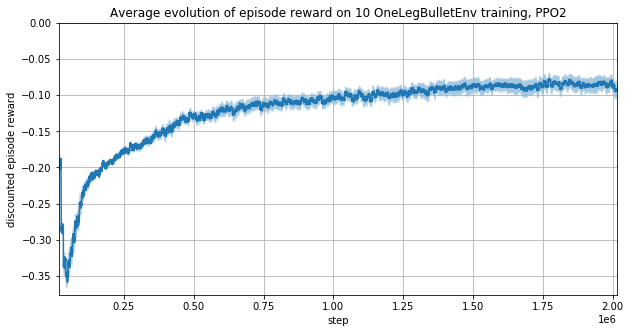
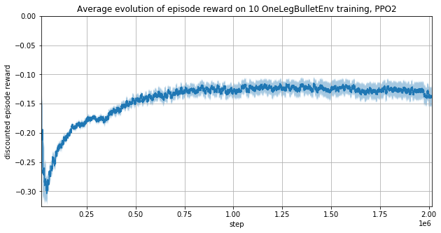
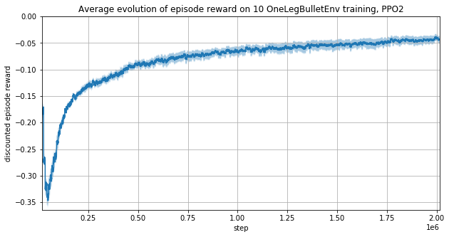
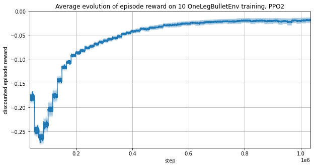
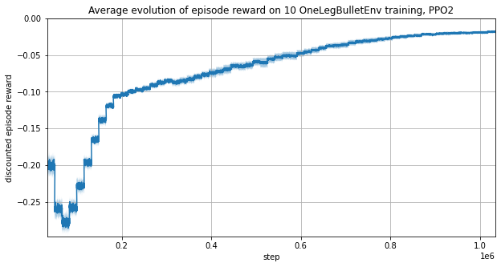

**Table of content**:

[TOC]

* * *

# Training one robot leg

This section gives some example and draws some conclusions about
the training of a single robot leg.

The environment resets the leg to a random position.
The agent has to command each servomotors
to move the fingertip to a random objective (visualized by the cross).

```Python
# Reset all joint using normal distribution
for j in self.joint_list:
    p.resetJointState(self.robot_id, j,
                      np.random.uniform(low=-np.pi/4, high=np.pi/4))

# Set random target in a 3D box
self.target_position = np.array([
    np.random.uniform(0.219 - 0.069*self.delta, 0.219 + 0.069*self.delta),
    np.random.uniform(0.020 - 0.153*self.delta, 0.020 + 0.153*self.delta),
    np.random.uniform(0.128 - 0.072*self.delta, 0.128 + 0.072*self.delta),
])
```


!!! Note

    Some early tests were done on StableBaselines3
    but as the library is currently being developed,
    the training was failing and the average episode reward was constant.

## First tests with a fixed objective

### With pytorch-a2c-ppo-acktr-gail

The defaults hyperparameters given in the
[pytorch-a2c-ppo-acktr-gail README](https://github.com/ikostrikov/pytorch-a2c-ppo-acktr-gail/blob/master/README.md)
are recommanded and are able to give good results for a first training.

!!! Warning

    The reward function is only using the distance to a **fixed** objective.
    This agent learned only to go to a fixed target.

The observation vector used here is:

| Num | Observation                                    |
| --- | ---------------------------------------------- |
| 0   | position (first joint)                         |
| 1   | velocity (first joint)                         |
| 2   | torque (first joint)                           |
| 3   | position (second joint)                        |
| 4   | velocity (second joint)                        |
| 5   | torque (second joint)                          |
| 6   | position (third joint)                         |
| 7   | velocity (third joint)                         |
| 8   | torque (third joint)                           |
| 9   | the x-axis component of the fingertip position |
| 10  | the y-axis component of the fingertip position |
| 11  | the z-axis component of the fingertip position |

The reward is `-target_distance`,
`target_distance` being the distance between the fingertip and the target.


!!! note

    16 trainings with different seeds were averaged to plot the previous figure.
    The light blue zone corresponds to the standard error.

**The training is successful and converges after 300k steps.**
The `enjoy.py` script shows the leg moving to the fixed target,
but it vibrates after reaching the objective.

### With StableBaselines

Start StableBaselines Docker as explained in [previous page](implementations_ppo.md).
Then in Jupyter web interface,

-   `check_env.ipynb` will check that OpenAI Gym environments are working as expected,
-   `one_leg_training.ipynb` is an example of PPO training on one leg,
-   `render.ipynb` will render the agent to a MP4 video or a GIF.

As planned, it works as well as `pytorch-a2c-ppo-acktr-gail` on PyTorch,
but this time we get much more tools such as
[TensorBoard](https://www.tensorflow.org/tensorboard) data and graph.

As StableBaselines stands out as being an easy PPO implementation
with a clear documentation and hyperparameters,
all the following training were done with it.

## Learning to go to a random target

Now we fix `delta = 0.5` to pick the target (x, y, z) such as,
0.1845 ≤ x ≤ 0.2535,
\-0.0565 ≤ y ≤ 0.0965,
0.0920 ≤ z ≤ 0.164.



!!! Warning "Batch size"

    As the target changes at each episode start,
    the batch size need to be large enough
    to make sure it contains some variance.

### First tests

We used the following code and hyperparameters to train using StableBaselines:

```Python
from stable_baselines.common.policies import MlpPolicy
from stable_baselines.common import set_global_seeds
from stable_baselines import PPO2
from stable_baselines.common.vec_env import SubprocVecEnv
import gym
from gym.wrappers import TimeLimit


def make_env(rank, seed=0):
    """
    Init an environment

    :param rank: (int) index of the subprocess
    :param seed: (int) the inital seed for RNG
    """
    timestep_limit = 128

    def _init():
        env = gym.make("gym_kraby:OneLegBulletEnv-v0")
        env = TimeLimit(env, timestep_limit)
        env.seed(seed + rank)
        return env
    set_global_seeds(seed)
    return _init

seed = 1
num_cpu = 16
env = SubprocVecEnv([make_env(i, seed) for i in range(num_cpu)])

# Use `tensorboard --logdir notebooks/stablebaselines/tensorboard_log/doc1` to inspect learning
model = PPO2(
    policy=MlpPolicy,
    env=env,
    gamma=0.99,  # Discount factor
    n_steps=512,  # batchsize = n_steps * n_envs
    ent_coef=0.0,  # Entropy coefficient for the loss calculation
    learning_rate=2.5e-4,
    lam=0.95,  # Factor for trade-off of bias vs variance for Generalized Advantage Estimator
    nminibatches=32,  # Number of training minibatches per update.
                      # For recurrent policies, the nb of env run in parallel should be a multiple of it.
    noptepochs=4,  # Number of epoch when optimizing the surrogate
    cliprange=0.2,  # Clipping parameter, this clipping depends on the reward scaling
    verbose=False,
    tensorboard_log="./tensorboard_log/doc1/",

    seed=seed,  # Fixed seed
    n_cpu_tf_sess=1,  # force deterministic results
)
model.learn(total_timesteps=int(2e6))
```

The observation vector used here is:

| Num | Observation                                    |
| --- | ---------------------------------------------- |
| 0   | position (first joint)                         |
| 1   | velocity (first joint)                         |
| 2   | torque (first joint)                           |
| 3   | position (second joint)                        |
| 4   | velocity (second joint)                        |
| 5   | torque (second joint)                          |
| 6   | position (third joint)                         |
| 7   | velocity (third joint)                         |
| 8   | torque (third joint)                           |
| 9   | the x-axis component of the fingertip position |
| 10  | the y-axis component of the fingertip position |
| 11  | the z-axis component of the fingertip position |
| 12  | the x-axis component of the target             |
| 13  | the y-axis component of the target             |
| 14  | the z-axis component of the target             |

The reward is `-target_distance`,
`target_distance` being the distance between the fingertip and the target.



<!-- TODO video -->

### Removing motors torque from observations

The observation vector used here is:

| Num | Observation                                    |
| --- | ---------------------------------------------- |
| 0   | position (first joint)                         |
| 1   | velocity (first joint)                         |
| 2   | position (second joint)                        |
| 3   | velocity (second joint)                        |
| 4   | position (third joint)                         |
| 5   | velocity (third joint)                         |
| 6   | the x-axis component of the fingertip position |
| 7   | the y-axis component of the fingertip position |
| 8   | the z-axis component of the fingertip position |
| 9   | the x-axis component of the target             |
| 10  | the y-axis component of the target             |
| 11  | the z-axis component of the target             |

The reward is `-target_distance`,
`target_distance` being the distance between the fingertip and the target.



It seems that the training is a bit faster
without motors torques as the observation vector is smaller.

<video style="max-width:100%;height:auto" preload="metadata" controls="">
<source src="https://perso.crans.org/erdnaxe/videos/projet_hexapod/training_one_leg_without_torque.mp4" type="video/mp4">
</video><br/>

The leg does not always reach the target and vibrates.

### Using cosinus and sinus of motor positions

This idea comes from [OpenAI Gym Reacher-v2 environment](https://github.com/openai/gym/wiki/Reacher-v2).

The observation vector used here is:

| Num | Observation                                    |
| --- | ---------------------------------------------- |
| 0   | cos(position) (first joint)                    |
| 1   | sin(position) (first joint)                    |
| 2   | velocity (first joint)                         |
| 3   | cos(position) (second joint)                   |
| 4   | sin(position) (second joint)                   |
| 5   | velocity (second joint)                        |
| 6   | cos(position) (third joint)                    |
| 7   | sin(position) (third joint)                    |
| 8   | velocity (third joint)                         |
| 9   | the x-axis component of the fingertip position |
| 10  | the y-axis component of the fingertip position |
| 11  | the z-axis component of the fingertip position |
| 12  | the x-axis component of the target             |
| 13  | the y-axis component of the target             |
| 14  | the z-axis component of the target             |



The training using cosinus and sinus is slower.

### Using the vector from the target to the fingertip

This idea also comes from [OpenAI Gym Reacher-v2 environment](https://github.com/openai/gym/wiki/Reacher-v2).

The observation vector used here is:

| Num | Observation                                                         |
| --- | ------------------------------------------------------------------- |
| 0   | position (first joint)                                              |
| 1   | velocity (first joint)                                              |
| 2   | position (second joint)                                             |
| 3   | velocity (second joint)                                             |
| 4   | position (third joint)                                              |
| 5   | velocity (third joint)                                              |
| 6   | the x-axis component of the vector from the target to the fingertip |
| 7   | the y-axis component of the vector from the target to the fingertip |
| 8   | the z-axis component of the vector from the target to the fingertip |
| 9   | the x-axis component of the target                                  |
| 10  | the y-axis component of the target                                  |
| 11  | the z-axis component of the target                                  |



Putting the vector from the target to the fingertip
rather than the fingertip position results in better learning performances.

<video style="max-width:100%;height:auto" preload="metadata" controls="">
<source src="https://perso.crans.org/erdnaxe/videos/projet_hexapod/training_one_leg_with_diff_target.mp4" type="video/mp4">
</video><br/>

### Optimizing hyperparameters

The observation used here is the same as the previous section but the hyperparameters are now:

```Python
num_cpu=32
ent_coef=0.01
nminibatches=64
noptepochs=30
total_timesteps=1e6
```



Increasing `noptepochs` increases GPU usage and make the learning converge much faster.
A learning of 1 million steps is done under 8 minutes on a Nvidia GTX1060 and an Intel i7-8750H. 

### Training without fingertip position

All previous learning put the fingertip position in the observation vector.
This is problematic to transfer from simulation to reality as this vector cannot be measured on the real system.
It may be found by solving the dynamic of the robot leg.
Another approach is to remove this data from the observation and see how much the learning performance fall.

The observation vector used here is:

| Num | Observation                        |
| --- | ---------------------------------- |
| 0   | position (first joint)             |
| 1   | velocity (first joint)             |
| 2   | position (second joint)            |
| 3   | velocity (second joint)            |
| 4   | position (third joint)             |
| 5   | velocity (third joint)             |
| 6   | the x-axis component of the target |
| 7   | the y-axis component of the target |
| 8   | the z-axis component of the target |



Not only the policy learned to reach the target
but it did it with less variance between learning runs.
