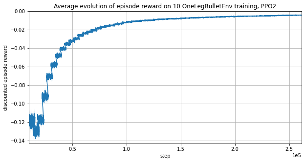

# Preparing transfer to real world

## Using bigger timesteps

At each time step, we need to gather observation from all servomotors.
It cannot be done in parallel as the robot uses only one serial connection.
**This limits the environment time step to 50 ms.**

This speed limit implies that we won't try torque control on servomotors as this looks too slow.

To train the policy with a time step of 50 ms,
we subdivide it by 12 to keep the physic simulation time step around 4 ms.

Compared to previous section, we changed the following training hyperparameters to take into account the new time step:

```Python3
timestep_limit = 32  # less steps are required
gamma=0.95  # Discount factor, lowered to reduce vibrations
n_steps=128  # batchsize reduced, less steps are required
learning_rate=10e-4  # better performance
```



<video style="max-width:100%;height:auto" preload="metadata" controls="">
<source src="https://perso.crans.org/erdnaxe/videos/projet_hexapod/transfer_real_world_simulation.mp4" type="video/mp4">
</video><br/>

**To reduce vibrations, the discount factor was reduced to 0.95.**
