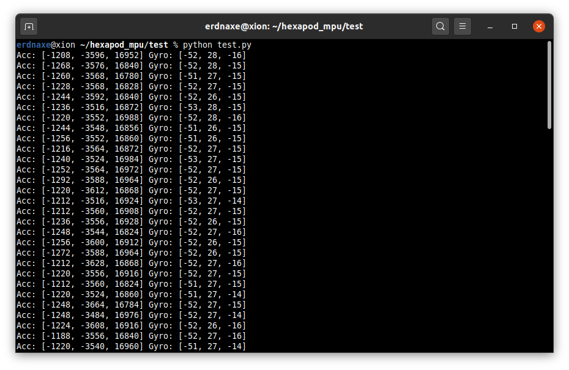

# Fetch raw data from MPU9250 sensors

Download, install and enable `iiod` server on NanoPi,

```bash
sudo apt install iiod
sudo systemctl enable iiod
```

Now any device on the network can interact with the inertial motion unit,
install `python3-libiio` then use the following code to get raw data,

```python
import iio

class IMUConnection:
    channels = ["accel_x", "accel_y", "accel_z",
                "anglvel_x", "anglvel_y", "anglvel_z"]

    def __init__(self, ip: str, device_name: str):
        self.ip = ip
        self.device_name = device_name

    def __enter__(self):
        """
        Connect to NanoPi and enable inertial motion unit device
        """
        context = iio.NetworkContext(self.ip)
        self.device = context.find_device(self.device_name)
        for c in self.channels:
            self.device.find_channel(c).enabled = True
        self.buffer = iio.Buffer(self.device, 1)
        return self

    def __exit__(self, *exc_info):
        """
        Disable channels on exit
        """
        for c in self.channels:
            self.device.find_channel(c).enabled = True

    def get_raw_acc_gyr(self):
        """
        Return raw output from accelerometer and gyrometer
        """
        self.buffer.refill()
        h = self.buffer.read()
        acc_raw = [int.from_bytes(h[i:i+2], byteorder='big',
                                  signed=True) for i in range(0, 6, 2)]
        gyr_raw = [int.from_bytes(h[i:i+2], byteorder='big',
                                  signed=True) for i in range(6, 12, 2)]
        return acc_raw, gyr_raw


with IMUConnection("10.42.0.1", "mpu6050") as imu:
    for i in range(100):
        acc_raw, gyr_raw = imu.get_raw_acc_gyr()
        print("Acc:", acc_raw, "Gyro:", gyr_raw)
```



_Note:_ You may install the documentation with the `libiio0-doc` package
and explore it by opening `/usr/share/doc/libiio0-doc/html` in a web browser.
